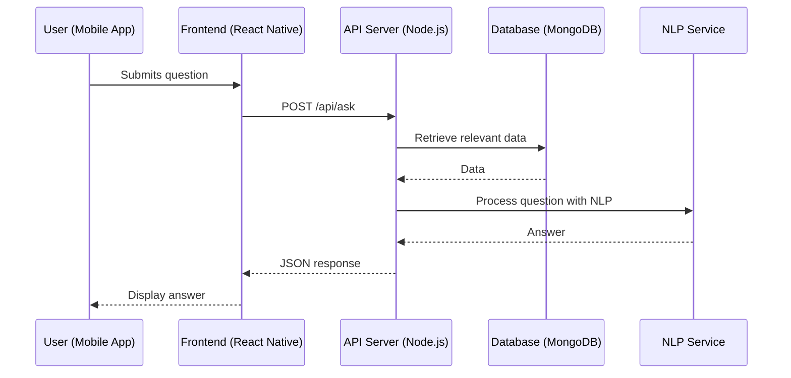
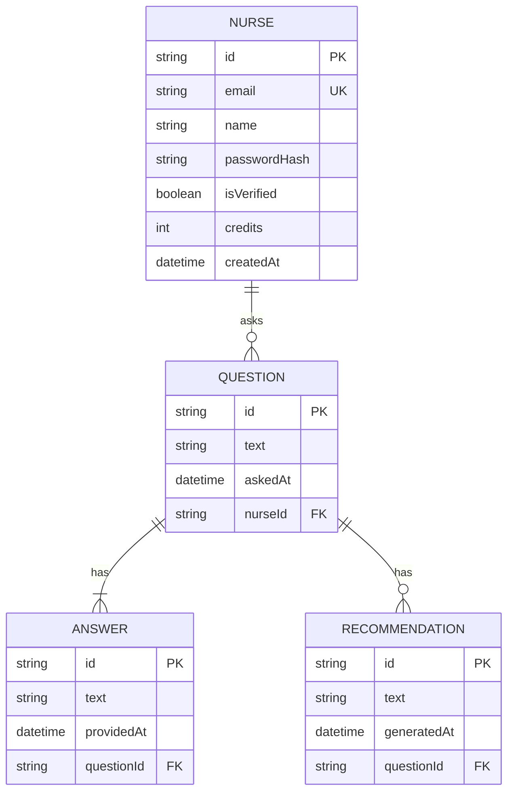

# MedMind
### MVP Architecture Document
> **Team:** Talha Zahoor · **Duration:** 32 weeks · **Stack:** React Native, Natural Language Processing, Machine Learning

---

## 1. Executive Summary
MedMind is an AI-powered knowledge platform designed for nurses, providing them with relevant, up-to-date medical information and guidelines. The platform utilizes natural language processing to answer nursing questions and offer personalized recommendations, aiming to improve patient care by overcoming the challenges nurses face in staying current with the latest medical research and guidelines. The end-user experience is centered around a mobile app, where nurses can easily access and interact with the platform's features, including an extensive medical knowledge base and tailored recommendations, all integrated with existing nursing workflows.

By leveraging AI and machine learning, MedMind aims to revolutionize the way nurses access medical knowledge, making it more efficient, personalized, and up-to-date. The platform's core value lies in its ability to understand the specific needs of nurses, provide accurate and timely information, and continuously learn and improve its recommendations based on user interactions. This document outlines the technical architecture and implementation plan for MedMind, focusing on delivering a high-quality, scalable, and maintainable solution within the given 32-week timeframe.

The success of MedMind is measured by its ability to provide accurate and relevant medical information, enhance the efficiency of nurses' workflows, and contribute positively to patient outcomes. By achieving these goals, MedMind can become an indispensable tool for nurses worldwide, setting a new standard for medical knowledge platforms and paving the way for further innovation in healthcare technology.

## 2. System Architecture Overview

### 2.1 High-Level Architecture Diagram
```
┌─────────────────────────────────┐
│         React Native         │
└────────────┬────────────────────┘
             │ HTTPS / REST
┌────────────▼────────────────────┐
│      Node.js API Server (Express) │
│  ┌──────────┐  ┌─────────────┐  │
│  │  Routes  │  │  Middleware │  │
│  └──────────┘  └─────────────┘  │
│  ┌──────────────────────────┐   │
│  │     Service Layer        │   │
│  └──────────────────────────┘   │
└───┬──────────────┬──────────────┘
    │              │
┌───▼───┐    ┌─────▼──────┐
│ MongoDB │    │ Natural Language │
│ Atlas   │    │ Processing (NLP)  │
└───────┘    └────────────┘
```

### 2.2 Request Flow Diagram (Mermaid)


### 2.3 Architecture Pattern
The architecture of MedMind follows a microservices pattern, with a focus on scalability, flexibility, and maintainability. This pattern is chosen to accommodate the evolving needs of the platform, allowing for the easy integration of new services or features without disrupting the existing architecture. Given the team size and the 32-week timeline, this approach enables efficient development and deployment of the platform's core components.

### 2.4 Component Responsibilities
- **Frontend (React Native):** owns the user interface, user interaction logic, and communicates directly with the API Server.
- **API Server (Node.js):** owns the business logic, data access, and communicates with the Frontend, Database, and NLP Service.
- **Database (MongoDB):** owns data storage and retrieval, communicating directly with the API Server.
- **NLP Service:** owns natural language processing, communicating directly with the API Server.

## 3. Tech Stack & Justification

| Layer | Technology | Why chosen |
|-------|-----------|------------|
| Frontend | React Native | Cross-platform mobile app development with a large community and rich set of libraries. |
| Backend | Node.js (Express) | Scalable, lightweight, and flexible for building the API Server. |
| Database | MongoDB | NoSQL document-oriented database for handling diverse and complex data structures efficiently. |
| NLP | Natural Language Processing Service | For accurate and efficient processing of natural language inputs. |

## 4. Database Design

### 4.1 Entity-Relationship Diagram


### 4.2 Relationship & Association Details
- **Nurse-Question Relationship:** A nurse can ask many questions, but each question is asked by one nurse. This is a one-to-many relationship, enforced at the application level through the API Server. The join strategy involves including the nurse's ID in each question document for easy lookup.
- **Question-Answer Relationship:** Each question can have one answer. This is a one-to-one relationship, enforced at the database level through unique indexes. When a question is deleted, its associated answer is also deleted (cascade delete).
- **Question-Recommendation Relationship:** A question can lead to many recommendations. This is a one-to-many relationship, with recommendations being generated by the NLP Service based on the question's content.

### 4.3 Schema Definitions (Code)
```typescript
const nurseSchema = new Schema({
  email: { type: String, required: true, unique: true, lowercase: true },
  name: { type: String, required: true },
  passwordHash: { type: String, required: true },
  isVerified: { type: Boolean, default: false },
  credits: { type: Number, default: 0 },
}, { timestamps: true });

const questionSchema = new Schema({
  text: { type: String, required: true },
  askedAt: { type: Date, default: Date.now },
  nurseId: { type: String, ref: 'Nurse' },
}, { timestamps: true });

const answerSchema = new Schema({
  text: { type: String, required: true },
  providedAt: { type: Date, default: Date.now },
  questionId: { type: String, ref: 'Question' },
}, { timestamps: true });

const recommendationSchema = new Schema({
  text: { type: String, required: true },
  generatedAt: { type: Date, default: Date.now },
  questionId: { type: String, ref: 'Question' },
}, { timestamps: true });
```

### 4.4 Indexing Strategy
- **Nurse Email Index:** A unique index on the `email` field for efficient lookup and to enforce uniqueness.
- **Question Text Index:** A text index on the `text` field for full-text search capabilities.
- **Question NurseId Index:** A single index on the `nurseId` field for fast retrieval of questions asked by a specific nurse.

### 4.5 Data Flow Between Entities
When a nurse asks a question, a new question document is created in the database with the nurse's ID referenced. The question text is then processed by the NLP Service to generate an answer and possibly recommendations, which are stored in separate documents referencing the question ID.

## 5. API Design

### 5.1 Authentication & Authorization
MedMind uses JSON Web Tokens (JWT) for authentication. Upon successful login, a JWT token is returned to the client, which must be included in the `Authorization` header for protected routes. Route protection is handled by middleware that verifies the token's validity and checks for required permissions.

### 5.2 REST Endpoints
| Method | Path | Auth | Request Body | Response | Description |
|--------|------|------|--------------|----------|-------------|
| POST | /api/login | No | `{email, password}` | `{token}` | Authenticate a nurse |
| POST | /api/questions | Yes | `{text}` | `{questionId}` | Ask a new question |
| GET | /api/questions | Yes |  | `[question]` | Retrieve all questions for the current nurse |
| POST | /api/answers | Yes | `{questionId, text}` | `{answerId}` | Provide an answer to a question |

### 5.3 Error Handling
Errors are handled through a centralized error handling middleware, returning a standardized error response that includes an error code, message, and any additional details for debugging purposes.

## 6. Frontend Architecture

### 6.1 Folder Structure
The `src` directory is organized as follows:
- `components`: Reusable UI components.
- `screens`: Application screens.
- `services`: API client and business logic.
- `utils`: Utility functions.
- `App.js`: Main application component.

### 6.2 State Management
The application uses React Context API for managing global state, specifically for user authentication and question/answer data. Local state is managed with React Hooks.

### 6.3 Key Pages & Components
- **Login Screen:** `/screens/Login.js` handles user authentication.
- **Question List Screen:** `/screens/QuestionList.js` displays all questions for the current nurse.
- **Ask Question Screen:** `/screens/AskQuestion.js` allows nurses to ask new questions.

## 7. Core Feature Implementation

### 7.1 AI-Driven Medical Knowledge Base
- **User Flow:** A nurse submits a question through the mobile app.
- **Frontend:** The `AskQuestion.js` component handles the question submission, sending a request to the API Server.
- **API Call:** `POST /api/questions` with the question text.
- **Backend Logic:** The API Server processes the question, calling the NLP Service for analysis and generating an answer and recommendations.
- **Database:** The question is stored in the database, linked to the nurse who asked it.
- **AI Integration:** The NLP Service is called with the question text, using a prompt template tailored for medical inquiries.
- **Code Snippet:**
```javascript
const analyzeQuestion = async (questionText) => {
  const nlpResponse = await nlpService.analyze(questionText);
  // Process nlpResponse to generate answer and recommendations
};
```

## 8. Security Considerations
- **Input Validation:** All user input is validated on both the client and server sides to prevent SQL injection and cross-site scripting (XSS).
- **Authentication Token Storage:** JWT tokens are stored securely on the client side, using secure storage mechanisms provided by React Native.
- **CORS Policy:** Configured to only allow requests from the React Native app's domain.
- **Rate Limiting:** Applied to prevent abuse and denial-of-service (DoS) attacks.
- **Environment Secrets Management:** Sensitive environment variables are managed securely using dotenv files and are not committed to version control.

## 9. MVP Scope Definition

### 9.1 In Scope (MVP)
- Nurse registration and login functionality.
- Asking and viewing questions.
- Receiving answers and recommendations from the AI-driven knowledge base.
- Basic user profile management.

### 9.2 Out of Scope (Post-MVP)
- Advanced filtering and sorting of questions and answers.
- Integration with external healthcare systems.
- Enhanced security features such as two-factor authentication.

### 9.3 Success Criteria
- **Functional Requirement:** The platform successfully authenticates nurses and provides relevant answers to their questions.
- **Performance Requirement:** The platform responds to user interactions within 2 seconds.
- **User Adoption Requirement:** A minimum of 100 nurses register and actively use the platform within the first 6 weeks post-launch.

## 10. Week-by-Week Implementation Plan

- **Weeks 1-4:** Setup project structure, implement authentication, and start building the frontend.
- **Weeks 5-8:** Develop the API Server, including routes for questions and answers.
- **Weeks 9-12:** Integrate the NLP Service for question analysis and answer generation.
- **Weeks 13-16:** Focus on database schema refinement and data modeling.
- **Weeks 17-20:** Implement security features, input validation, and rate limiting.
- **Weeks 21-24:** Conduct thorough testing, including unit tests, integration tests, and end-to-end testing.
- **Weeks 25-32:** Finalize the MVP, deploy to production, and monitor performance.

## 11. Testing Strategy

| Type | Tool | What is tested | Target coverage |
|------|------|---------------|-----------------|
| Unit | Jest | Individual components and functions | 80% |
| Integration | Jest | API endpoints and database interactions | 70% |
| End-to-End | Detox | Complete user flows and app functionality | 60% |

## 12. Deployment & DevOps

### 12.1 Local Development Setup
1. Clone the repository.
2. Run `npm install`.
3. Start the development server with `npm start`.

### 12.2 Environment Variables
- `NODE_ENV`: Development or production environment.
- `DB_URI`: Database connection string.
- `NLP_API_KEY`: NLP Service API key.

### 12.3 Production Deployment
MedMind will be deployed on a VPS, with a CI/CD pipeline set up using GitHub Actions to automate testing and deployment.

## 13. Risk Register

| Risk | Likelihood | Impact | Mitigation |
|------|-----------|--------|-----------|
| Delay in NLP Service Integration | Medium | High | Prioritize NLP Service integration, allocate additional resources if necessary. |
| Insufficient Testing | High | Medium | Ensure thorough testing across all layers of the application. |
| Security Vulnerabilities | Medium | High | Implement robust security measures, regularly update dependencies, and perform security audits. |
| User Adoption | Medium | High | Develop a user-friendly interface, offer clear documentation and support, and engage with the nursing community for feedback. |
| Technical Debt | Low | Medium | Regularly review and refactor code, prioritize maintainability and scalability. |

---
*Generated by Inceptzon — Fri Apr 03 2026*